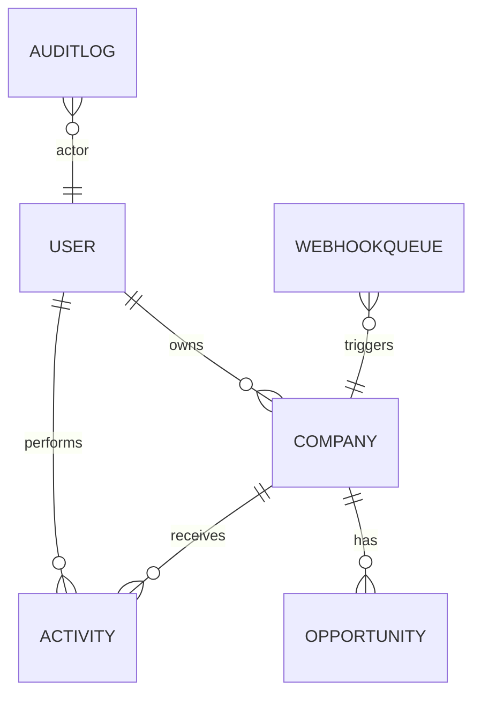

**Notion — Best Practices pro BlackBox CRM**

Tento dokument je připravený pro vložení do Notion. Obsahuje doporučení pro architekturu, datový model, škálování uživatelů, follow‑up workflow, návrhy pohledů (dashboardy / grafy), notifikace, integrace a provozní runbooky. Součástí jsou také šablony databází a check‑listy vhodné pro rychlé vložení do Notion.

--

## Přehled cílů

- Zajištění škálovatelné a auditovatelné platformy pro správu leadů a příležitostí.
- Jednoduché workflow pro follow‑up a notifikace (připomenutí, e‑mail, webhooky).
- Pohledy pro obchodníky i management (KPI, konverzní trychtýř, měsíční pipeline).
- Snadná operativní správa (migrace uživatelů, rollbacks, backup/restore).

## Architektura (v kostce)

- Backend: FastAPI + SQLAlchemy + Alembic (migrace). JWT auth přes `fastapi-users`.
- Frontend: React + Vite + Tailwind — komponentní dashboard + admin UI.
- Background: jednoduchý worker (periodické úlohy) nebo Celery/Redis pro produkci.
- Úložiště statických souborů a médií: S3 + CDN pro produkci.
- CI/CD: GitHub Actions — build, test, e2e, image artifacts, publish (Docker Hub/GHCR).

## Datový model (hlavní entity)

Krátký popis entit a doporučené indexy:

- `User` — (id, email, hashed_password, full_name, role, is_active, created_at). Index: `email` (unique), `role`.
- `Company` / `Lead` — (id, name, email, phone, source, lead_score, owner_id FK->User, created_at). Index: `owner_id`, `lead_score`.
- `Opportunity` — (id, company_id FK, title, value, stage, probability, close_date, owner_id). Index: `company_id`, `owner_id`, `stage`.
- `Activity` (FollowUp / Note) — (id, lead_id, user_id, type, content, scheduled_at, completed_at, status). Index: `scheduled_at`, `lead_id`.
- `WebhookQueue` — (id, payload, event_type, attempts, next_try_at, status). Index: `next_try_at`, `status`.
- `AuditLog` — (id, event_type, actor_id, target_type, target_id, payload, ts). Index: `ts`, `actor_id`.

### Mermaid ERD (vložit jako blok v Notion)

Poznámka: mermaid v Notion není nativní — v Notion vložte jako code block nebo použijte obrázek (export SVG/PNG). V Notion lze vytvořit DB „Companies“, „Opportunities“, „Activities“ s doporučenými properties (viz níže).

## Škálovatelnost uživatelů a multi‑tenancy

- Pokud potřebujete škálovat přes více zákazníků (multi‑tenant): volba izolace dat je klíčová: schema per tenant, DB per tenant nebo shared schema s tenant_id.
- Pro SMB/demo projekty doporučuji shared schema + `tenant_id` a row‑level security (pokud DB podporuje) pro oddělení dat.
- Indexujte často používané dotazy (owner_id, stage, scheduled_at) a monitorujte pomalé dotazy (EXPLAIN ANALYZE).

## Follow‑up workflow (best practice)

1. Lead vzniká (import / manuálně / web form / mobile). Automaticky se spustí scoring (AI nebo heuristika).
2. Pokud `lead_score >= threshold`, vytvoř `Activity` typu `call` nebo `email` s due date (se SLA: do 24h).
3. Owner dostane notifikaci (in‑app + e‑mail + optional push). Pokud neodpoví v čase `T`, escalation: vytvoření followup task pro manažera.
4. Aktivity mají statusy: `scheduled`, `in_progress`, `completed`, `skipped`.
5. Všechny změny auditovat do `AuditLog`.

Automatizace: používáme background queue pro připomenutí a retry notifikací (webhooky).

## Pohledy a dashboardy (Notion / frontend)

- **KPI Panel (Management):** Měsíční nové leads, konverze lead→opportunity, MRR/ARR (pokud relevantní), win rate.
- **Sales Pipeline (Funnel):** Opportunities grouped by `stage` + expected value (sum of `value * probability`).
- **Activities Today:** zobrazit `scheduled_at` pro následující 24/7 hodin pro každého ownera.
- **Follow‑up Aging:** table view s počtem dní od posledního kontaktu (> X dní = flag).

V Notion vytvořte databázi `Dashboard` s view typu `Board` (by stage) a `Chart` embed (použít externí charting nebo Notion widgety).

## Notifikace a integrace

- E‑mail: transactional service (SendGrid/Mailgun) pro registraci, reset hesla, follow‑up reminders.
- Webhooks: retry + DLQ pro doručení eventů do externích systémů (např. marketing automation). Ukládejte stav a pokusy.
- Integrace: CRM sync, telephony (Twilio), calendar (Google Calendar) pro záznamy meetingů.

## Bezpečnost a operace (runbook)

- **Secrets:** všechny tajné hodnoty v environment (Pydantic BaseSettings / `.env` pro lokál). V CI použít GitHub Secrets.
- **Migrations:** používat Alembic; před migrací provést backup DB, preview migrace na staging.
- **Backups:** denní dump + retention 7–30 dní; ověřovat restore pravidelně.
- **Monitoring:** metriky (Prometheus/Grafana) + logging (ELK/Datadog) + alerting (pager/Slack).
- **Incident:** krokový plán — identifikovat, komunikovat, rollback z backupu, root cause.

## Notion šablony (DB properties)

- `Companies / Leads` properties (Notion DB):
  - `Name` (Title)
  - `Email` (Email)
  - `Phone` (Phone)
  - `Owner` (Person / Relation to Users DB)
  - `Lead Score` (Number)
  - `Status` (Select: New, Contacted, Qualified, Lost)
  - `Next Activity` (Date)

- `Activities` properties:
  - `Type` (Select: Call, Email, Meeting, Note)
  - `Lead` (Relation to Companies/Leads)
  - `Owner` (Person)
  - `Scheduled At` (Date)
  - `Status` (Select)
  - `Notes` (Text)

- `Opportunities` properties:
  - `Title` (Title)
  - `Company` (Relation)
  - `Stage` (Select)
  - `Value` (Number / Currency)
  - `Probability` (Number %)
  - `Expected Close` (Date)

## Check‑listy (kopírovatelný blok)

**Checklist — Před produkční migrací `fu_users -> users`**
- [ ] Vytvořit úplný backup DB
- [ ] Vypnout zapisovací aktivity nebo přepnout do maintenance režimu
- [ ] Spustit `scripts/migrate_fu_users_to_users.py --dry-run` a ověřit report
- [ ] Spustit migraci v testním prostředí (restore z backupu)
- [ ] Spustit migraci v produkci, ověřit integritu
- [ ] Provést smoke testy (login, CRUD leadu)
- [ ] Odstranit staré tabulky (a udělat rollback instrukce)

**Checklist — Nasazení (staging → production)**
- [ ] Tag verze a build image
- [ ] Uložit artefakty (image tar nebo push do registry)
- [ ] Spustit migrace (backup předem)
- [ ] Spustit health checks a smoke tests
- [ ] Monitorovat metriky po nasazení 30–60 min

## ERD a indexy — doporučení

- Indexy: `users(email)`, `companies(owner_id)`, `activities(scheduled_at)`, `opportunities(stage, owner_id)`.
- Partitioning: u velmi velkých tabulek (audit, webhookqueue) zvážit partitioning podle `ts` nebo `status`.

## Šablony Notion (přesné kroky)

1. Vytvořte nový Page → Database → Table (Companies). Přidejte properties podle výše.
2. Vytvořte další DB (Opportunities, Activities, Users, AuditLog). Propojte relation properties.
3. V Dashboard Page vložte relation a vytvořte Board view (Opportunities by Stage) a Table view (Activities Today).
4. Optionálně vložte grafy přes externí nástroj a embed do Notion.

## Další kroky (roadmap)

1. Implementovat Pydantic `BaseSettings` v backendu a přidat `backend/.env.example`.
2. Dokončit migraci `fu_users` → `users` (test + runbook + backup).
3. Nasadit Celery/Redis pro background jobs a monitoring (Flower/Prometheus).  
4. Přidat Dependabot a security scans do CI (pip-audit/safety).

---

Pokud chceš, přidám tento soubor do repozitáře (`docs/notion-best-practices.md`) a vytvořím lokální commit s popiskem. Napiš `commit` pro potvrzení nebo `necommit` pokud chceš provést ručně.
